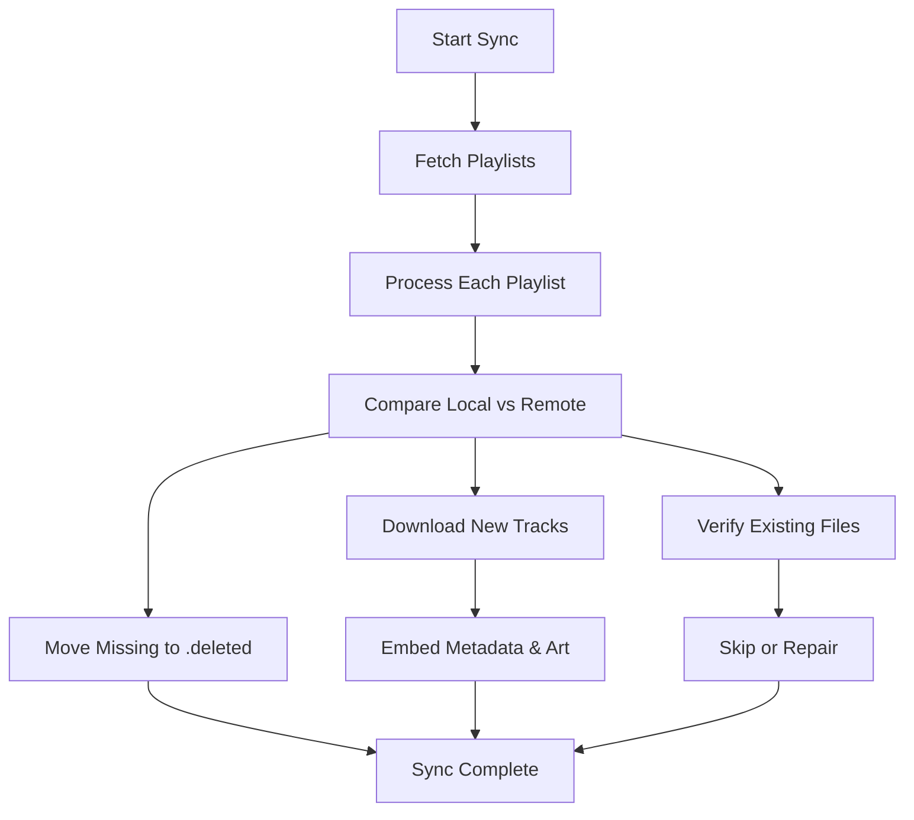

# YT-Music-Downloader 🎵

[](https://www.python.org/downloads/)
[](https://opensource.org/licenses/MIT)
[](https://github.com/yt-dlp/yt-dlp)
[](https://github.com/quodlibet/mutagen)

> [!NOTE]
> This project was developed in 100% collaboration between a human user and an AI assistant, following strict technical requirements for a production-grade library mirroring tool.

A high-fidelity Python tool for synchronizing your **YouTube Music** library with local, high-quality **.opus** files. Built for users who value offline access, metadata accuracy, and a seamless mirror-like experience.

---

## 💎 Key Features

-   **🔄 Library Mirror Mode**: Automatically discovers all your playlists and mirrors them locally. 
-   **🧹 Orphaned File Management**: Remote deletions move local files to a hidden `.deleted/` folder.
-   **🛡️ Data Integrity**: Validates Ogg Opus structures and auto-repairs corrupted downloads.
-   **🏷️ Rich Metadata**: Injects high-quality Artist, Album, and Title tags.
-   **🖼️ Optimized Thumbnails**: Fetches covers direct from YTMusic API at **800x800 JPEG** for best quality.
-   **⚡ High Concurrency**: Multi-threaded playlist indexing and downloads.
-   **🚫 Collision Resistance**: Smart naming prevents duplicate titles via artist/duration suffixes.

---

## 🛠️ How it Works



## 🛠️ Prerequisites

1.  **Python 3.8+**
2.  **FFmpeg**: Critical for audio extraction and metadata embedding.
    -   **Windows**: `choco install ffmpeg`
    -   **Linux**: `sudo apt install ffmpeg`
    -   **macOS**: `brew install ffmpeg`

---

## 🚀 Quick Start

### 1. Environment Setup

#### **Windows**
```powershell
python -m venv .venv
.\.venv\Scripts\Activate.ps1
pip install -r requirements.txt
```

#### **Linux / macOS**
```bash
python3 -m venv .venv
source .venv/bin/activate
pip install -r requirements.txt
```

### 2. Authentication
1. **Headers**: Run `python3 setup_auth.py` (or `python` on Windows) and follow browser instructions.
2. **Cookies**: (Optional) For premium content, place a Netscape `cookies.txt` in the root.

---

## ⚡ Usage

To synchronize your entire library:
```bash
# Activation (Linux/macOS)
source .venv/bin/activate

# Activation (Windows)
.\.venv\Scripts\Activate.ps1

# Run
python sync.py
```

---

## ⚙️ Configuration (`config.json`)

| Parameter | Default | Description |
| :--- | :--- | :--- |
| `download_dir` | `downloads/` | Final destination for your music library. |
| `max_workers` | `3` | Number of simultaneous playlist/track downloads. |
| `mirror_mode` | `true` | Moves orphaned files to `.deleted/` instead of erasing. |
| `audio_quality` | `0` | Opus VBR quality (`0` = best/max, higher number = lower quality). |

---

## ❓ Troubleshooting

-   **"FFmpeg not found"**: Ensure FFmpeg is installed and in your system **PATH**.
-   **"401 Unauthorized"**: Session headers expired. Delete `headers.json` and re-run `setup_auth.py`.
-   **"0MB Files"**: Check disk space or ensure `yt-dlp` is [updated](https://github.com/yt-dlp/yt-dlp/releases).

> [!TIP]
> Use `.deleted/` as your safety net. If you accidentally remove a song on YT Music, it will be waiting for you there!

---

## ⚖️ License

Distributed under the **MIT License**. Use responsibly for personal backups.